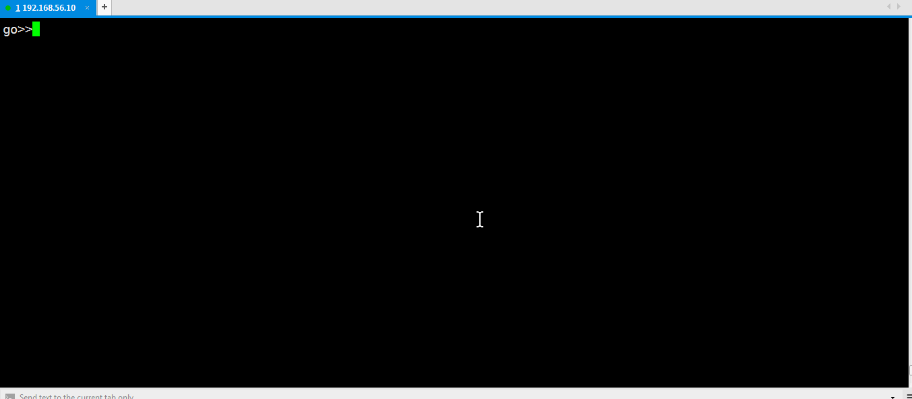
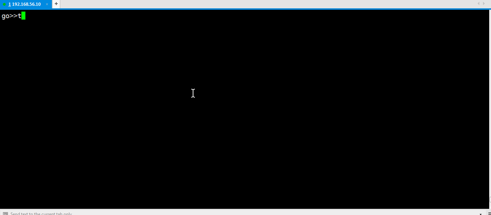
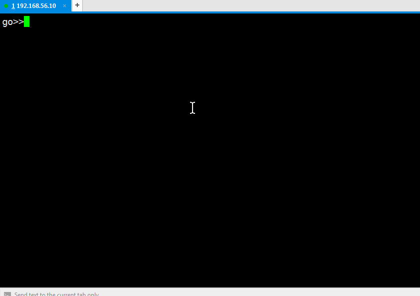
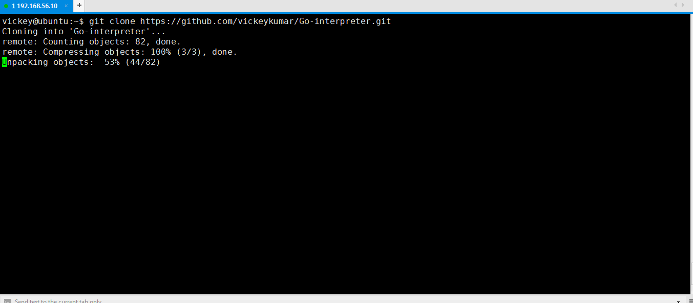

# Go-interpreter

A python based go REPL like python command line to write and execute small go code snippets. If you want to test your go code snippets quickly or experiment with golang, please give it a try.

### Usage and Examples
Use command "gointerpreter" to start the gointerpreter:


### Demo using documentation, loop and editing the inline code using default editor like vi


### Demo using structs, array and slices


### encoding/json


## Prerequisites

Go-interpreter requires 
* Go and godoc binaries [installed](https://golang.org/doc/install) in your system path. please set your GOPATH before installing.
* Pretty printing for go [pp](https://github.com/k0kubun/pp) 
```
go get github.com/k0kubun/pp
```
* Showing documents requires [godoc](https://golang.org/x/tools/cmd/godoc)

## Installation

clone this repository in your local machine and run following commands:
```
git clone https://github.com/vickeykumar/Go-interpreter.git
```

OS X & Linux:

```
cd Go-interpreter
sudo make install
```

Example



Windows:

use gointerpreter.py directly to access the go REPL.
```
python gointerpreter.py
```

## Inspiration

gointerpreter is greatly inspired by python like interactive shell/REPL where user can easily experiment with language and learn faster.


## TODO

* Syntax completion
* Configuration
* API
* ~~Pretty Printing~~
* Undoing input


## Author

Vickey Kumar <kumarvickey45@gmail.com>
