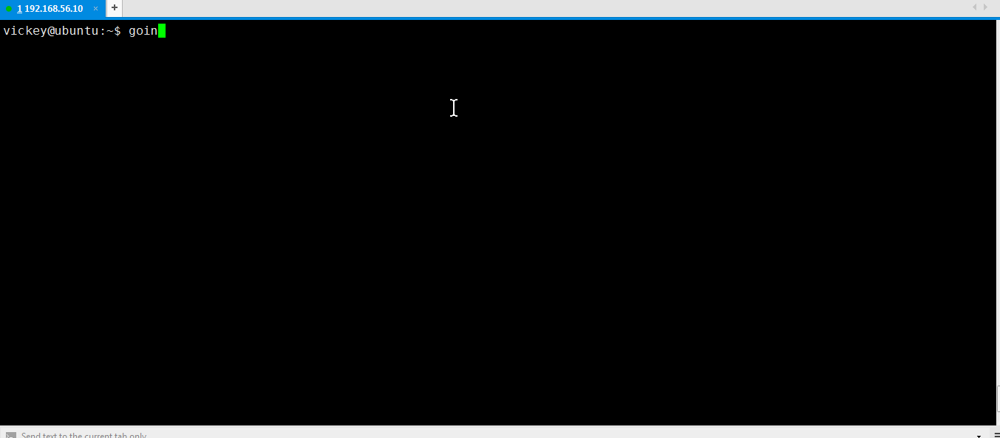

# Go-interpreter
A python based go REPL like python command line to write and execute small go code snippets. If you want to test your go code snippets quickly or experiment with golang, please give it a try.

Example


## Prerequisites

Go-interpreter requires go and godoc binaries installed in your system path. please set your GOPATH. 

## Installation

OS X & Linux:

```
cd Go-interpreter
sudo make install
```

Example


Windows:

use gointerpreter.py directly to access the go REPL.
```
python gointerpreter.py
```

## Inspiration

gointerpreter is greatly inspired by python like interactive shell/REPL where user can easily experiment with language and learn faster.


## TODO

* Undoing input
* syntax completion
* API
